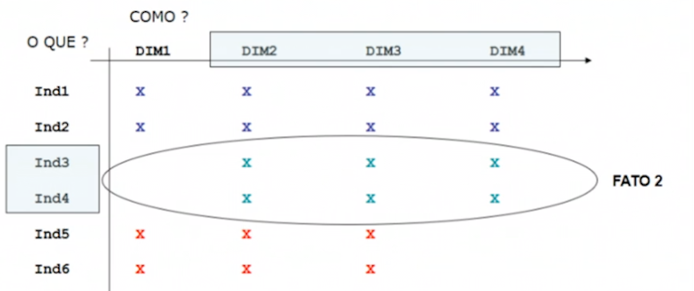

# Resultados das Entrevistas

Para conhecermos o negocio fazer entrevistas de nossos usuarios (executivos que tomam decições) para conhecer os principais indicadores chaves de succeso da empresa.

* Entrevistas
    - 1. O que quero analizar?
        - Indicador/medida ou variáveis.

    - 2. Como quero analizar os dados?
        - Dimensão, para identificar os indicadores.

* Matriz Dimensão X Indicador

    - Nas Linhas: **O Que? os indicadores(filas)**
        - Indicador: Qual informação quero ver(Vendas, Custos, Lucro, num, funcionarios, num, etc...)
    
    - Nas Colunas: **Como? as dimensões(colunas)**
        - Dimensão: Como quero ver a informação, (Cliente, empresa, tempo, etc.)

    

* projetar as tabelas de data werehouse (tabelas de fato)
    
    
    

    representando as tabelas:
    dim1,dim2,dim3,dim4 -> chaves primarias

    | tab1 | tab2 | tab3 |
    | -- | -- | -- |
    |*Dim1| *Dim2 | *Dim1 |
    |*Dim2| *Dim3 | *Dim2 |
    |*Dim3| IND3 | *Dim3 |
    |*Dim4| IND4 | IND5 |
    | IND1 |  | IND6 |
    | IND2 |  | |

* Detalhes de uma dimensão
    

    - Nas Linhas:
        - Indicador: Qual informação quero ver(Mensagens)
        
    - Nas Colunas: 
        - Dimensão: Como quero ver a informação, (Cliente, empresa, tempo, segmento, produto)

* Relação entre as entidades da dimensão

    

* Tabelas de Domensão

    - Modelos Estrela tambem são conhecidos como STAR SCHEMAS, (desnormalizado)
    - Modelos Floco de Neve tambem são conhecidos como SNOW FLAKE SCHEMA.

* Hierarquias ou Atributo

* Dimenções irregulares

* Dimensão Tempo

    - Granularidade:
        É o menor grão da dimensão tempo associado a uma ocorrência.
    - Periodicidade:
        É o menor grão da dimensão onde eu faço as 'fotografias'.

        niveis de agregacao do tempo
        - milisegundos
        - segundo
        - Quarto de hora
        - Hora
        - Periodo(Manha, Tarde ou Noite)
        - Dia
        - Dia da semana
        - Semana do Mês
        - Mês
        - Bimestral
        - Trimestral
        - Semestral
        - Anual
        - Década
    
    Num mesmo modelo gerencial podemos ter indicadores com granularidade e Periodicidades diferentes.
    exem:
    - venda de um produto(Granularidade diaria)
    - Custo de mao de obra (Granulariddae mensal)

* Extract, Transform, Load - ETL  

    - Limpeza de dados
    - Lookup, tabela temporaria para filtrar variables.

    
    - Union, diferentes bancos de dados.
    - Funcoes de Datas:
        . Mes da data
        . ano da data
        . dia da data
        . hora da data
        . mudança de formato de data.
        . soma ou subtração de dados.
    - funçoes de transformação, para strings
        . concatenar
        . dividir
        . subtituir
        . formato de saida (REGEX)
        . tirar brancos
    - Funcoes matemáticas
        . equações 
        . arredondamento
        . transformação entre unidades numericas.

    - TABELAS ODS (tabelas auxiliares)

* O QUE É OLAPs (performance de data warehouse)?

    - e uma tabela com multples dimenções.
    - comparamos com um cubo.

* Tipos de OLAPs
    

* Esparcividade

                    Num de combinações Reais
    esparcividade = --------------------------
                    Num de combinacões posiveis

    Separar os OLAP pos assuntos
        . OLAP de vendas
        . OLAP de financeiros
        . OLAP de contab

    - Tipos de OLAPs
        - MOLAP, multidimensional OLAP
        - HOLAP, hibrido OLAP
        - ROLAP, realtional OLAP

* Relatorios Análiticos

    - Identificando as expectativas
        . Análises Ad-Hoc (aberto - analitico)
            abertas pode abrir para o cliente customizar (tipo uma tabela dinamica do excel).
        . Análises Padronizadas (certa flexibilidade, mantendo o padrao)
            . analises de ranking ordenadas por um criterio de escolha do usuario.
            . ranking dos produtos
            . analise de pareto
            . analise de curva vc
            . analise de excesoes
        . Análises customizadas (relatorio bem apresentado)
            . customizadas prontas para o cliente so ver. tipo dashboard custommizdas prontas so para o usuario ver.