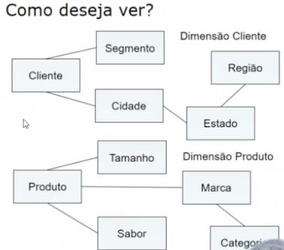
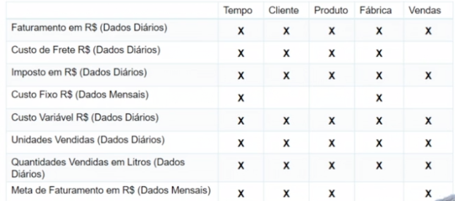
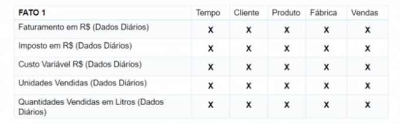
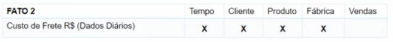
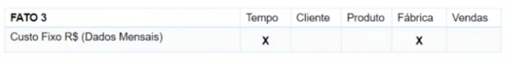
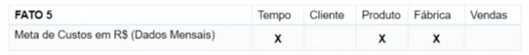
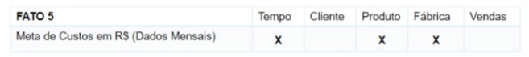
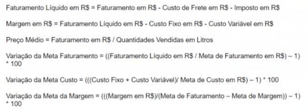

# Passos para ciação de BI

- Matriz
- Construcão de Data Warehouse
- identificaçãodas fontes de dados
- Criação do processo ETL e/ou construcão de ODS
- Carga de data Warehouse, Criação e carga dos OLAPs.
- Construção e criação dos aplicativos para consulta dos dados por parte dos usuarios.

## Matriz de dimensionamento de uma empresa
    
* O que Deseja ver?

    - faturamento em R$
    - Custo de Frete em R$
    - Imposto em R$
    - fatuarmento liquido em R$
    - Custo Fixo em R$
    - Custo variavel em R$
    - Margem de lucro em R$
    - Unidades Vendidas 
    - Quantidades vendidas
    - Preço medio
    - Meta de faturamento em R$
    - Meta de custos em  R$
    - Variação da Meta do faturamento
    - Variação da Meta dos Custos (%)
    - Variação da Meta da Margem (%)
    
* Como deseja Ver?
    
    - Data (dia a dia)
    - Cliente
    - Segmento
    - Estado
    - Cidade
    - Regiao
    - Fabrica
    - Produto
    - Tamanho
    - Sabor
    - Marca
    - Categoria
    - Atendente
    - Gerente de vendas
    - Diretor de vendas.

* verificar relacionamento de tableas

    

    - matriz 
    

    - fato 1
    
    - fato 2
    
    - fato 3
    
    - fato 4
    
    - fato 5
    

* Indicadores a calcular

    
* dimensionameto criados
    - produto
    - tempo
    - Organizacional
    
## Variacões do BI

