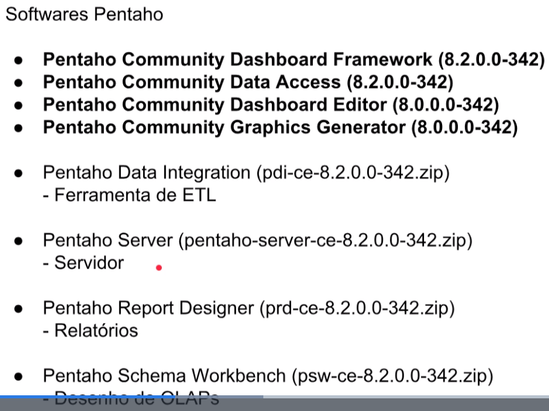

# software pentaho

## download pentaho

[download from source forge](https://sourceforge.net/projects/pentaho/files/Pentaho%209.1/client-tools/)

pdi-ce (ferramentas de ETL)
> https://sourceforge.net/projects/pentaho/files/Pentaho%209.1/client-tools/pdi-ce-9.1.0.0-324.zip/download

prd-ce (Relatorios)
> https://sourceforge.net/projects/pentaho/files/Pentaho%209.1/client-tools/prd-ce-9.1.0.0-324.zip/download

psw-ce (constructor de cubos - desenho de OLAPs)
> https://sourceforge.net/projects/pentaho/files/Pentaho%209.1/client-tools/psw-ce-9.1.0.0-324.zip/download

pentaho-server
> https://sourceforge.net/projects/pentaho/files/Pentaho%209.1/server/pentaho-server-ce-9.1.0.0-324.zip/download

### software de apoio

- Java (JRE) - Requisito para execucao de Pentaho
- Mysql - Podemos instalr uma versao standalone
- MS SQL Server 2017
- Connector MySQL
- Conector MySQL Server
- HeidiSQL
- SQL Power Architect
- 7Zip

